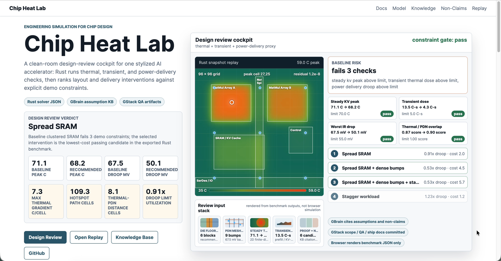

# Chip Heat Lab

**Engineering simulation for chip design, shown as one simplified early-design design-review demo.**



## Pitch

Hardware teams do not need another pretty heatmap in isolation. They need a
fast way to turn an early floorplan question into a reviewable engineering
decision: what failed, which intervention passed, what it cost, and which
assumptions make the answer trustworthy.

**Chip Heat Lab** is that workflow in miniature. For one stylized AI accelerator
floorplan, Rust computes steady thermal risk, transient thermal dose, and a
bounded power-delivery droop proxy, then ranks candidate interventions against
explicit demo constraints.

The deliverable is end to end:

- a native macOS SwiftUI app that calls the Rust CLI through JSON,
- a Vercel replay that renders exported Rust snapshots and benchmark files,
- a GBrain-ready assumption knowledge base for citations and claim boundaries,
- GStack-style scope, review, QA, ship, and retro artifacts,
- deterministic tests, benchmarks, visual smoke checks, and release scripts.

This is intentionally not the full product. It is a clean-room public wedge:
one narrow design-review artifact that proves the shape of value. A future
production system could go much deeper: richer geometry ingestion, more solver
families, validation ladders against reference cases, native evidence packs,
team review workflows, and integrations with real hardware design flows. This
repo stays honest by showing the smallest useful version without borrowing
private code or claiming production validation.

## Relationship To Anvil Sim

Anvil Sim is the broader flagship project. Chip Heat Lab is a brand-new public
clean-room electronics-simulation slice built for this hackathon: no private
Anvil Sim solvers, source, assets, or architecture were reused. The point of
this repo is to show one benchmarked chip-design review workflow with explicit
limits, then make the improvement path obvious.

## Why Hardware Teams Care

Early chip-design reviews are full of "what should we inspect next?" decisions:
floorplan placement, bursty workload behavior, cooling budget, and power
delivery tradeoffs are coupled, but teams still need a crisp next action before
running heavier tools. Chip Heat Lab turns one such question into a small,
auditable review packet:

- **Design question:** can spreading SRAM reduce KV-cache hotspot risk before
  changing the cooling budget?
- **Computed evidence:** steady thermal peak, transient thermal dose,
  power-delivery droop proxy, hotspot movement, and ranked candidates.
- **Decision output:** the lowest-cost passing intervention for the simplified
  constraints.
- **Trust surface:** deterministic Rust benchmarks, native replay, generated
  knowledge index, explicit non-claims, and committed review/QA artifacts.

The value is not final accuracy. The value is reducing ambiguity in an early
review: make the tradeoff visible, make the assumptions inspectable, and make
the next engineering conversation concrete.

## Flagship Workflow

The flagship value loop is deliberately decision-shaped:

```text
baseline clustered-SRAM KV-cache design
  -> steady thermal peak
  -> transient thermal dose
  -> power-delivery droop proxy
  -> simplified constraints
  -> ranked intervention recommendation
```

That is the main demo promise: Chip Heat Lab does not ask judges to trust a
pretty field image. It shows a baseline review, the specific simplified
constraints that failed, the candidate fixes Rust evaluated, and the lowest-cost
passing intervention for this clean-room model.

## Links

- GitHub: <https://github.com/qinjianxyz/chip-heat-lab>
- Live site: <https://chip-heat-lab.vercel.app>
- Replay: <https://chip-heat-lab.vercel.app/replay>
- Knowledge base: <https://chip-heat-lab.vercel.app/knowledge>
- App release: <https://github.com/qinjianxyz/chip-heat-lab/releases/tag/v0.1.0-hackathon-preview>
- Final narration script: [`docs/final-demo-narration-script.md`](docs/final-demo-narration-script.md)

## What You Can Demo In 90 Seconds

1. Open the public site and show the design-review cockpit.
2. Explain that the baseline fails simplified peak, thermal-dose, and droop
   constraints.
3. Show Rust's recommendation: spread SRAM is the lowest-cost passing
   intervention for this demo review.
4. Open the macOS app and run the flagship floorplan.
5. Toggle clustered versus spread SRAM to show the visible field change behind
   the recommendation.
6. Show the transient and power-delivery proxy benchmark sections.
7. Open the knowledge page to show the GBrain-ready assumption system.
8. Open `docs/gstack/` to show the GStack scope/review/QA/ship artifacts.

## Why This Is More Than A Heatmap

- **One shared floorplan:** steady thermal, transient dose, and the
  power-delivery proxy all evaluate the same stylized AI accelerator layout.
- **One review question:** "Which intervention should I inspect first for this
  KV-cache risk?" is answered by benchmark JSON from the Rust CLI.
- **Inspectable recommendation:** every ranked candidate carries peak
  temperature, thermal dose, worst droop, pass/fail constraints, and demo cost.
- **Knowledge-backed explanation:** the app/site consume a generated GBrain-ready
  KB index instead of hardcoding unsupported prose.
- **GStack discipline:** scope lock, engineering review, QA, ship, canary, and
  remaining founder gates live in repo docs, so the hackathon build process is
  reviewable.

## Review Now

```bash
bash scripts/verify.sh
bash scripts/visual_smoke_test.sh
python3 scripts/submission_readiness_check.py
bash scripts/render_demo_video_draft.sh
bash scripts/prepare_recording_session.sh
bash scripts/stitch_founder_demo.sh 60 <browser.mov> <native.mov> <knowledge.mov>
bash scripts/stitch_founder_demo.sh 90 <browser.mov> <native.mov> <knowledge.mov>
bash scripts/stitch_founder_demo.sh 120 <browser.mov> <native.mov> <knowledge.mov>
bash scripts/run_site_demo.sh
bash scripts/run_macos_demo.sh
```

- Site: `http://localhost:4177`
- Replay: `http://localhost:4177/replay`
- Knowledge: `http://localhost:4177/knowledge`
- Native app: `scripts/run_macos_demo.sh` prepares the Rust binary and launches
  the SwiftUI app through Swift Package Manager.
- Submission readiness: `scripts/submission_readiness_check.py` checks the
  public site, GitHub CI, branch protection, prerelease assets, public benchmark
  JSON, and remaining human blockers.
- Recording dry run: `scripts/render_demo_video_draft.sh` renders a silent
  90-second storyboard MP4 from captured stills under `dist/demo-capture/` and
  `dist/demo-video/`.
- Manual recording prep: `scripts/prepare_recording_session.sh` opens the
  public site, replay, knowledge page, and native app, then leaves them ready
  for a live screen recording. Use `scripts/prepare_recording_session.sh local`
  for a local web server. Stop local mode or quit the app with
  `scripts/stop_recording_session.sh`.
- Founder clip stitcher: `scripts/stitch_founder_demo.sh 60|90|120|raw`
  is an optional local helper for pre-recorded browser, native, and knowledge
  clips; pass the three `.mov` paths as arguments or set the
  `CHIP_HEAT_LAB_DEMO1..3` environment variables. See
  `docs/final-demo-edit-plan.md`.
- Double-click bundle: `scripts/bundle_macos_app.sh` writes
  `dist/ChipHeatLab.app` for local review. It is unsigned.
- Release zip: `scripts/package_macos_release.sh hackathon-preview` writes a
  zipped unsigned app bundle plus checksum and manifest under `dist/`.

## Repository Layout

- `crates/chip_heat_core` - model types, floorplan generation, finite-difference
  solver, and tests.
- `crates/chip_heat_cli` - JSON stdin/file CLI wrapper around the core solver.
- `apps/macos/ChipHeatLab` - SwiftUI app package with a `RustRunner` process
  boundary and bundled resources.
- `site` - Vercel-ready Next.js public site and replay pages.
- `kb` - GBrain-importable markdown knowledge base.
- `scripts` - KB indexing, non-claim linting, snapshot export, and verification.
- `docs/gstack` - planning, review, QA, ship, canary, and retro artifacts.
- `docs/review-runbook.md` - exact local review flow for judges and teammates.
- `docs/next-steps.md` - current hackathon checklist after the foundation commit.
- `docs/submission-copy.md` - founder-review draft copy for the hackathon form.
- `docs/founder-review-packet.md` - final approval packet for the video
  candidate, submission copy, and remaining human gate.
- `docs/demo-recording-runbook.md` - final human recording script with
  web-first and native-first options.
- `docs/final-demo-narration-script.md` - the founder-read narration script for
  the final submission recording.
- `docs/final-demo-edit-plan.md` - edit timing, voiceover, and 60/90/raw cut
  plan for the founder-recorded clips.
- `docs/final-demo-voiceover-60.txt`, `docs/final-demo-voiceover-90.txt`, and
  `docs/final-demo-voiceover-120.txt` - standalone narration scripts for the
  founder-recorded cuts.
- `docs/demo-60s-script.md` - one-minute recording script for the web, native
  app, replay, knowledge, and GStack/GBrain story.

## Quick Start

```bash
cargo test --quiet
cargo run --quiet -p chip_heat_cli -- --input scenarios/flagship.json
bash scripts/run_value_benchmark.sh
bash scripts/run_transient_value_benchmark.sh
bash scripts/run_power_delivery_benchmark.sh
bash scripts/run_design_review_benchmark.sh
python3 scripts/generate_kb_index.py
bash scripts/export_snapshots.sh
bash scripts/visual_smoke_test.sh
```

The CLI accepts a scenario JSON document via `--input <path>` or stdin and emits
a `SimulationResult` JSON payload with `temperature_grid`, `peak_c`,
`peak_cell`, `hotspot_centroid`, `per_block_max`, `residual`, `iterations`, and
`warnings`.

## Design Review Benchmark

The flagship benchmark asks the value-creation question directly: which
lowest-cost intervention makes the KV-cache design review pass the simplified
thermal and power-delivery constraints?

```bash
bash scripts/run_design_review_benchmark.sh
```

The script drives the Rust CLI in `--design-review` mode and writes
`benchmarks/design_review/results.json`. In the checked-in result, the baseline
clustered-SRAM design has a `71.085 C` steady KV peak, `13.490 C-s` transient
thermal dose, and `67.534 mV` worst droop, failing all three demo constraints.
The recommended intervention is `Spread SRAM`, which lowers those metrics to
`68.236 C`, `4.263 C-s`, and `50.124 mV` with the lowest passing demo cost
score. This is the main usefulness proof: the app does not just draw a field,
it turns simplified model outputs into a ranked design-review decision.

The benchmark is intentionally small enough to inspect but rich enough to show
workflow value:

- `Stagger workload` removes transient dose but still fails steady thermal and
  droop constraints.
- `Aggressive cooling` fixes thermal behavior but still fails the droop proxy.
- `Dense power bumps` fixes droop but still fails thermal constraints.
- `Spread SRAM` is the lowest-cost candidate that passes all three simplified
  gates in the checked-in review.

Those tradeoffs are the demo's usefulness claim. They are not physical
validation, package modeling, or manufacturing approval.

## Value Benchmark

The value-loop benchmark asks one practical demo question: for a KV-cache-heavy
workload, does spreading SRAM change hotspot and peak behavior before spending
cooling budget?

```bash
bash scripts/run_value_benchmark.sh
```

The script runs the Rust CLI for four cases and writes
`benchmarks/value_loop/results.json`. In the checked-in result, spread SRAM
reduces the KV workload peak from `71.085 C` to `68.236 C`, a `2.849 C`
reduction in this simplified model, while moving the hotspot centroid by
`15.052` grid cells. As a comparison control, aggressive cooling lowers the
training workload peak from `84.055 C` to `58.979 C`. This is usefulness proof
for the demo loop, not physical validation.

## Transient Value Benchmark

The transient value-loop benchmark asks a more realistic design-review question:
for a bursty AI accelerator workload trace, should we spend budget on spreading
SRAM, stronger cooling, or workload staggering?

```bash
bash scripts/run_transient_value_benchmark.sh
```

The script drives the Rust CLI in `--transient` mode and writes
`benchmarks/transient_value_loop/results.json`. In the checked-in result, the
baseline trace reaches `72.939 C`, spends `12.100 s` over the demo threshold,
and accumulates `13.189 C-s` of thermal dose. Stronger cooling is the top-ranked
intervention in this simplified model, while workload staggering removes the
same over-threshold dose without changing the floorplan or cooling preset.

## Power Delivery Proxy Benchmark

The power-delivery proxy benchmark asks one adjacent hardware question: for the
same floorplan and power map, do bump density and SRAM placement change the
simplified droop stress proxy?

```bash
bash scripts/run_power_delivery_benchmark.sh
```

The script drives the Rust CLI in `--power-proxy` mode and writes
`benchmarks/power_delivery_proxy/results.json`. In the checked-in result,
nominal KV clustered SRAM has `67.534 mV` worst droop, dense bumps reduce that
to `41.438 mV`, and spread SRAM with nominal bumps reduces it to `50.124 mV`.
The thermal/droop hotspot overlap score is `0.869` for the nominal clustered
case. This is usefulness proof for the demo loop, not a physical PDN model.

## Site

Live: <https://chip-heat-lab.vercel.app>

```bash
npm --prefix site install --silent
npm --prefix site run build --silent
npm --prefix site run dev -- --port 4177
```

The replay page reads JSON snapshots exported by the Rust CLI from
`site/public/snapshots/`; it does not reimplement the solver. The knowledge
page reads the generated KB index from `site/public/kb/kb_index.json`.

For quiet visual proof:

```bash
bash scripts/visual_smoke_test.sh
```

The script checks homepage, knowledge, and replay routes, then writes headless
screenshots under `dist/visual-proof/` when Chrome or Chromium is available.

## macOS App

The SwiftUI package lives at `apps/macos/ChipHeatLab`. During local packaging,
copy the compiled Rust CLI into the app resources:

```bash
bash scripts/prepare_macos_resources.sh
cd apps/macos/ChipHeatLab
swift run ChipHeatLab
```

For a local double-click bundle:

```bash
bash scripts/bundle_macos_app.sh
open dist/ChipHeatLab.app
```

The generated bundle is unsigned. Signing/notarization is a release step, not a
simulation claim.

For a local release archive:

```bash
bash scripts/package_macos_release.sh hackathon-preview
ls -lh dist/ChipHeatLab-macos-unsigned-hackathon-preview.zip
(cd dist && shasum -a 256 -c ChipHeatLab-macos-unsigned-hackathon-preview.zip.sha256)
cat dist/ChipHeatLab-macos-unsigned-hackathon-preview.zip.sha256
```

This archive is for hackathon review and demo recording. It is unsigned and
not notarized.

## Non-Claims

Chip Heat Lab is not a design verification tool. It is a deliberately simplified
early concept demo. The precise excluded categories are listed in
`docs/non-claims.md`, and the lint script blocks those phrases from general
project copy.
